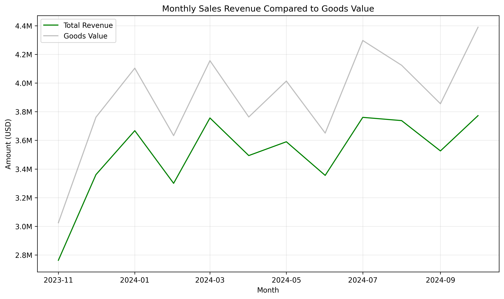
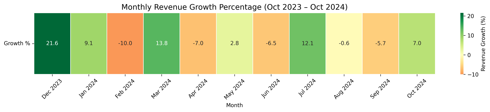

# E-Commerce_Analysis

## Project Background

An online retailer has been operating at a loss over the last year since their restructing their supply chain. The business is struggling to keep up with the incosistent pricing due to old promotions, coupons and online deals. I have been tasked to extract insights on revenue as well as provide recommendations on how to help linearise and consolidate their pricing to generate profits.

## Executive Summary

The business generated $42,495,704.81 in revenue between October 2023 and October 2024, however the total value of the goods sold was $47,229,907.98 resulting in a new loss of $4,734,203.17. On average each item was sold at 90% of its actual value, at its crux this is where all business should be targetting its focus to operate in the green. The largest category of sales came from electronics encompassing 35.9% of total revenue with the lowest being furniture encompassing 14.7%. In total, 1997 different products were sold to consumers and these products were purchased by the business from 100 different suppliers. The was no consistent category of products that were sold at a loss, at times the same product would be sold at a loss and at a profit to different customers. This calls for a drastic complete review of pricing policies, supplier agreements and discount structures.

## Insights and Analysis

### Monthly Trends
- The business averaged $3,507,040.49 in revenue and 1,652 orders each month.
- October generated the largest revenue and loss with a revenue-to-value ratio of 0.86%, a total of $616,860.83 in losses.
- The revenue growth fluctated between -7% and 10% growth rates, without any obvious signs of seasonality where December sales matching Feburary sales.
- Each month conistently saw electronics as the highest category of sales and furniture as the lowest.

note: December 2023 growth is slightly inaccurate due to incomplete data for November 2023

### Distribution of Sales
- Sales amongst the four categories: Accessories, Electronics, Furniture and Home & Kitchen stayed consistent throughout the year.

| Category | Revenue | % of Total Revenue |
| --- | --- | --- |
| Electronics | $15,247,167.14 | 0.36 |
| 	Home & Kitchen | $11,182,785.90 | 0.26 |
| Accessories | $9,833,968.69 | 0.23 |
| Furniture | $6,231,783.08 | 0.15 |
