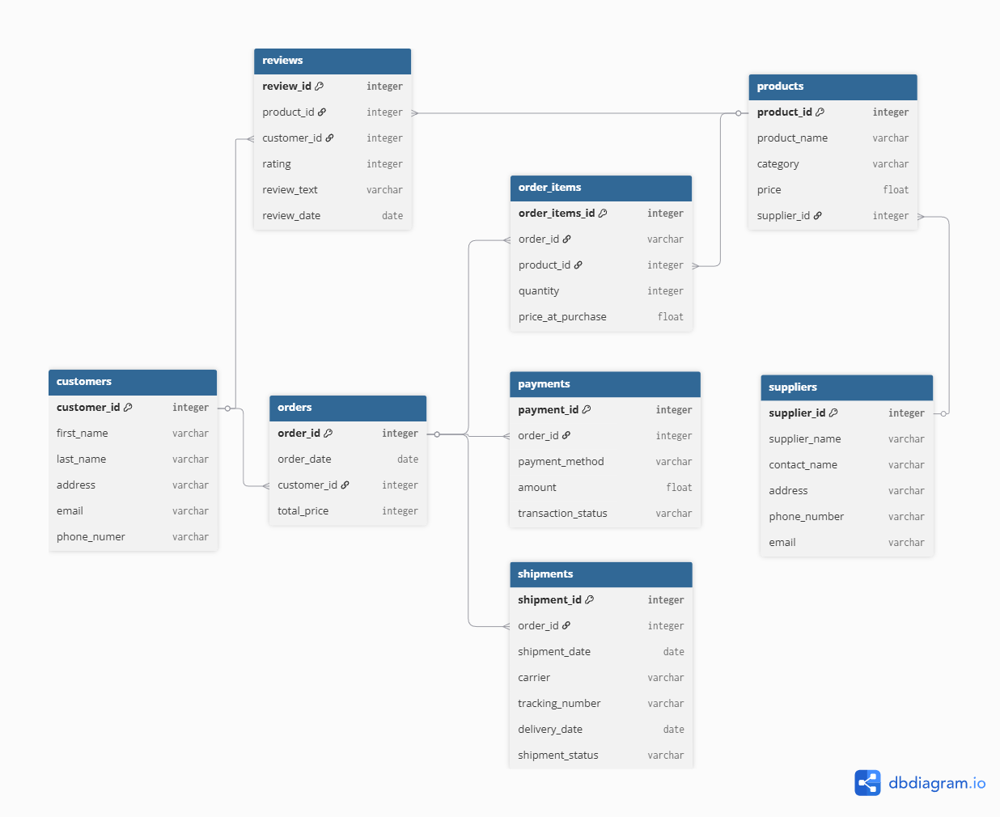

# E-Commerce Analysis

## Project Background

An online retailer has been operating at a loss over the last year since their restructing their supply chain. The business is struggling to keep up with the incosistent pricing due to old promotions, coupons and online deals. I have been tasked to extract insights on revenue as well as provide recommendations on how to help linearise and consolidate their pricing to generate profits.

## Executive Summary

The business generated $42,495,704.81 in revenue between October 2023 and October 2024, however the total value of the goods sold was $47,229,907.98 resulting in a new loss of -$4,734,203.17. On average each item was sold at 90% of its actual value, at its crux this is where all business should be targetting its focus to operate in the green. The largest category of sales came from electronics encompassing 35.9% of total revenue with the lowest being furniture encompassing 14.7%. In total, 1997 different products were sold to consumers and these products were purchased by the business from 100 different suppliers. The was no consistent category of products that were sold at a loss, at times the same product would be sold at a loss and at a profit to different customers. This calls for a drastic complete review of pricing policies, supplier agreements and discount structures.

## Insights and Analysis

### Monthly Trends
- The business averaged $3,507,040.49 in revenue and 1,652 orders each month.
- October generated the largest revenue and loss with a revenue-to-value ratio of 0.86%, a total of $616,860.83 in losses.
- The revenue growth fluctated between -7% and 10% growth rates, without any obvious signs of seasonality where December sales matching Feburary sales.
- Each month conistently saw electronics as the highest category of sales and furniture as the lowest.

note: December 2023 growth is slightly inaccurate due to incomplete data for November 2023

### Distribution of Sales
- The ranking of sales amongst the four categories: Accessories, Electronics, Furniture and Home & Kitchen stayed consistent throughout the year.
- The growth of these categories between months were almost identical to each other. This indicates that the sales performance across categories is likely influenced by overarching seasonal trends or promotions, rather than category-specific factors.
- This consistency implies that products from different categories are likely serving distinct customer needs, with minimal overlap. In other words, they do not significantly cannibalise each other’s sales, which supports a diverse product strategy without risk of internal market dilution.

| Category | Revenue | % of Total Revenue |
| --- | --- | --- |
| Electronics | $15,247,167.14 | 0.36 |
| 	Home & Kitchen | $11,182,785.90 | 0.26 |
| Accessories | $9,833,968.69 | 0.23 |
| Furniture | $6,231,783.08 | 0.15 |

- The distribution of the volume of each product being sold follows a normal distribution where the median is 45. This shows that the number of sales are being driven by a diverse catalouge of products with only a small number of outliers on either tail. These results can help us derive which products to potentially discontinue.
- The 20% cutoff of top sellers should be emphasised when considering any alterations of prices as they driving the highest customer engagement. These products produce the highest losses, amounting to $-3,719,297.66.
- 228 products contribute to the top 20% of overall sales by volume.

- The average product was sold at a loss of -$2,370.66, the median loss was -$2,228.28 out of all 1,997 sold products.
- The highest loss was on the laptop sleeve, amounting to -$60,938.32. This is likely due to the high goods value of $611.11, where the supplier is selling to the business at obscenely high costs.
- The highest profit was on the rice cooker , amounting to $55,705.99.
- There was no consistent time or category amongst the extremities indicating that a thorough and product specific reconfiguration of pricing is necessary.

### Performance by Supplier
- Mega Suppliers had the lowest average return on sale at -$300.79 per item. A total of 957 items from Mega Suppliers were sold at a loss amounting to -$287,856.44
- Notably, all 100 supplier had items that sold at a loss. On a positive note, each supplier also had items that sold at a profit.
- The highest profit was by Premier Logistics Inc. Their products made a total of 989 proitable sales, generating $229,196.98 in profit. Accounting for the unprofitable transactions, Premier Logistics Inc was still the highest overall profitable supplier with a total of $86,217.08 out of 1,978 sales.

## Recommendations and Further Action
### Consolidating Prices Structure
- Due to the inconsistency and heavy losses, we should remove legacy pricing that are caused by outdated promotions and coupon codes.
- Implement a centralised pricing system to ensure that all sales channels reflect current and consistent pricing.
- Create hard price floors per product to avoid selling below cost, with automated alerts when prices fall below this threshold. The threshold can be initially set to 95% of the items value and slowly increased back to 100% to ease customer adaptation. This phased approach ensures smoother alignment with profitability goals without immediate customer churn. Specifics can be discussed with the products team and business managers to handle satisfactory negotiations with suppliers for future orders.
### Prioritise Pricing Review For High-Volume Products
- Conduct a product-level margin audit for the top 20% of products by volume (228 products) since these account for the highest engagement and the greatest losses ($-3.7M).
- Introduce tiered discounting only for these high-volume products, and restrict discounts on low-margin goods.
- Consider dynamic pricing for high-performing SKUs based on demand elasticity.
### Restructure Supplier Agreements
- Re-evaluate supplier contracts, particularly those with recurring losses—e.g., Mega Suppliers with average per-item losses of $300+.
- Negotiate better wholesale pricing or implement performance-based incentive clauses that tie supplier revenue to end-consumer profit margins. usiness managers should leverage the company’s consistent sales volume and low seasonality as bargaining power. By demonstrating reliable demand even during quieter months, the business can secure more favourable pricing or rebate agreements that align supplier incentives with profitability goals.
### Product Rationalisation
- Discontinue or re-price products that consistently generate losses and fall below the median sales volume threshold (35 units per year).
- Focus inventory and marketing efforts on high-performing products in each category to reduce warehousing and logistics costs.
### Seasonal Campaign Optimisation
- While no clear seasonal trend was found, trial targeted campaigns around known e-commerce peaks (e.g., Black Friday, Christmas season) to test elasticity and profitability by product type.
- Use prior months’ top sellers and profitable products as a guide for promotional focus.

Dataset ERD

